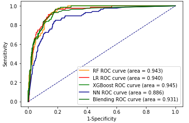

# Prediction of Bank Marketing Based on Machine Learning

## Description

This is a model comparation project for **IE 7615 Neural Networks/Deep Learning** in Northeastern University. This project is mainly about **comparing  the performance between DNN, RF, LR, XGBoost,  with bank marketing dataset**. The some details about this project are shown below.  **You can read the FinalReport file for more detail about this project. The code is in scripts file for data visualization, analyzing and modeling **.

## Abstract

Machine Learning is becoming an efficient way in many areas to do prediction and we have discussed many theories especially in finance. Trying to put theory into practice, we propose an approach to make a prediction of bank marketing. In this report, we analysis the structure of dataset and then do data processing to ensure our data is ready to input. Then we compare four different algorithms, Random Forest(RF), Logistic Regression(LR), XGBoost and Neural Network(NN), to explore the efficiency. Further, we blend all these four models to make a new prediction. Two evaluation methods are applied in this report: the class report and ROC. The results show that XGBoost(precision = 0.6, f1-score = 0.92, area of ROC = 0.945) perform better than other four models. Notwithstanding that XGBoost is good at find the number of people who are willing to subscribe term deposit as many as possible, LR approach is the most efficient way to find true potential client.

## Motivation

Often we contact with clients by phone call to know if they will subscribe a term deposit. Notwithstanding phone call is a direct way to get in touch with clients, it’s inefficient and a waste of human resource. For the foregoing reason, we have developed a system to distinguish the person with high probability to subscribe a term deposit.

## Overview

In this report, we first explore the structure of our dataset by drawing histogram and violin plot. Then we transfer features of string types into numeric as input of our approach. Third, we calculate the correlation between outcomes and features to explore the significance of our features. Also, smote approach is applied to balance our training dataset. Since our dataset is ready, we do tests to compare four algorithms, Random Forest(RF), Logistic Regression(LR), XGBoost, Neural Network(NN) and blending models. The results reveals that the performance of XGBoost(precision = 0.6, f1-score = 0.92, area of ROC = 0.945) is the best. Notwithstanding that XGBoost is good at find the number of people who are willing to subscribe term deposit as many as possible, LR approach is the most efficient way to find true potential client.

